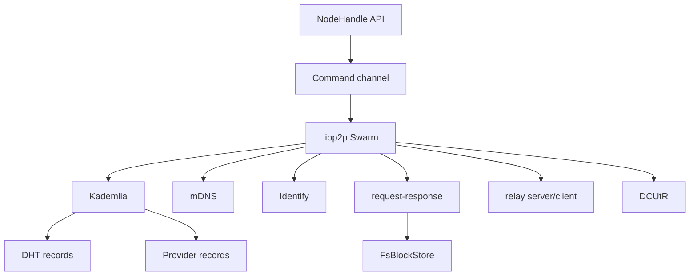
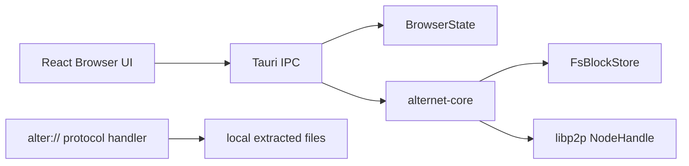

# AlterNet Architecture

AlterNet is a peer-to-peer publishing system built from several independent
layers: identity, content addressing, signed publishing, naming, exchange,
replication, privacy routing, discovery, and sandboxed applications.

This document describes the implementation in this repository.

## Design Goals

1. **No central server:** publishing and fetching use peer-to-peer protocols.
2. **No account authority:** identity is a local Ed25519 keypair.
3. **Content integrity by construction:** every block is addressed by its BLAKE3
   hash.
4. **Signed mutable sites:** site updates are manifests signed by the publisher.
5. **Local trust and naming:** human-friendly names are local petnames or
   Web-of-Trust records.
6. **User-controlled replication:** pinning content makes the user a provider.
7. **Privacy as a routing layer:** padding, chaff, onion, and Tor modes are
   modeled separately from content integrity.
8. **Sandboxed compute:** WASM applications run with explicit capabilities.

## Workspace Structure

```text
AlterNet-master/
├─ alternet-core/              protocol library
├─ alternet-cli/               command-line interface
├─ alternet-node/              headless seed/relay daemon
├─ alternet-browser/           Tauri desktop browser
└─ libp2p-community-tor/       vendored Tor transport adapter
```

## Layer Map

| Layer | Module | Responsibility |
| --- | --- | --- |
| L1 | `identity` | local Ed25519 identity, `alter://` address encoding |
| L2 | `naming` | petnames, WoT resolution, zone delegation |
| L3 | `content` / `types` | CID, Merkle DAG, block store, CBOR |
| L4 | `exchange` / `network` | block exchange, DHT, request-response |
| L5 | `publish` | signed manifests and append-only history |
| L6 | `routing` / `onion` / `traffic` | privacy levels, padding, chaff, onion routing |
| L7 | `apps` | signed WASM apps and capability sandbox |
| L8 | `discovery` / `board` | tags, feeds, CRDT board experiments |
| Ops | `replication` / `config` | pinning, seeding, GC, node configuration |

## Content Model

### CID

`Cid` is a 32-byte BLAKE3 hash:

```text
CID = BLAKE3(encoded_block)
```

Every received block is verified by recomputing the CID. If bytes do not match,
the block is rejected.

### DAG Nodes

AlterNet stores files and directories as CBOR-encoded DAG nodes:

```rust
DagNode::Leaf { data }
DagNode::Internal { links, total_size }
DagNode::Directory { entries }
```

- `Leaf` stores a data block, at most 256 KiB before encoding.
- `Internal` stores ordered child CIDs for large files.
- `Directory` stores sorted directory entries for deterministic CIDs.

### Optional Content Encryption

`build_dag_keyed` encrypts leaf data with AES-256-GCM when a content key is
provided. Directory and internal nodes remain visible, so file names and sizes
can still leak metadata. The manifest records that content is encrypted, but the
decryption key is intentionally not stored in the manifest.

## Publishing Model

`publish.rs` creates signed manifests:

```text
Manifest {
  version,
  author,
  sequence,
  root_cid,
  created_at,
  metadata,
  signature
}
```

The signature is computed over the manifest with an empty signature field. A
receiver verifies:

1. supported manifest version
2. non-empty author
3. non-empty signature
4. public-key decoding
5. Ed25519 signature
6. sequence monotonicity when using `ManifestStore`

This separates immutable block storage from mutable site identity.

## Network Model



`network.rs` runs the swarm in the background and exposes an async `NodeHandle`.
The handle supports:

- `listen_on`
- `dial`
- `put_manifest`
- `get_manifest`
- `put_dht`
- `get_dht`
- `start_providing`
- `get_providers`
- `request_block`
- `request_block_onion`
- `known_peers`
- `send_chaff`
- relay-key announcement and lookup

### Request-Response Protocol

`exchange.rs` defines:

- `PoWHandshake`
- `WantBlock`
- `WantBlocks`
- `HaveQuery`
- `WantManifest`
- `OnionForward`

Responses include:

- `Block`
- `Blocks`
- `DontHave`
- `HaveList`
- `Manifest`
- `ManifestNotFound`
- `OnionResult`

The current network event loop directly serves local block files for
`WantBlock` and answers `HaveQuery` from the local block store.

## Privacy Routing

`routing.rs` defines four privacy levels:

| Level | Behavior | Intended Use |
| --- | --- | --- |
| `Clear` | no padding or delay | local tests |
| `Padded` | 512-byte padding, chaff, time-blind delay | default privacy baseline |
| `Onion` | onion-wrapped block requests through relay route | sender-hiding experiments |
| `Tor` | Tor transport at network layer | IP-hiding experiments |

The default configuration is `Padded`. The network layer also starts a chaff
task when padding and chaff are enabled.

Onion requests are built by CBOR-encoding an exchange request, wrapping it in
fixed-size onion layers, and sending it to the first hop. Each relay only sees
the previous peer and the next hop.

## Naming Model

AlterNet intentionally avoids global DNS.

### Self-Certifying URI

```text
alter://<base32-public-key>
```

The key embedded in the URI is the identity. There is no external registrar.

### Petnames

`PetnameStore` maps local names to public keys:

```text
alice -> alter://<alice-key>
```

Petnames are local. Your `alice` and another user's `alice` can point to
different keys.

### Web of Trust

`WotResolver` can resolve names through trusted peers' signed petname lists.
The resolver uses bounded BFS and ignores non-positive trust edges.

### Zone Delegation

A publisher can sign delegation for a subname:

```text
alter://alice/blog -> alter://<child-key>
```

Only the parent key can validly delegate its own zone.

## Replication and Pinning

`replication.rs` provides:

- `PinRecord`
- `PinStore`
- `Replicator`
- mark-and-sweep GC
- quota-aware unpinning

Pinning content records all known block CIDs under a root. A headless node can
refresh provider records periodically so other peers can discover the content.

## CLI Architecture

`alternet-cli` is the primary developer tool.

Command groups:

- `identity`: generate, show, backup, restore
- `publish`: build DAG, create manifest, announce providers
- `fetch`: resolve manifest, fetch blocks, extract DAG
- `pin`: fetch and reseed content
- `name`: petname and zone delegation operations
- `search`: tag lookup
- `app`: sign and run WASM apps
- `feed`: subscribe/pull trusted author manifests
- `board`: CRDT board post/read

Each networked command starts a local node, waits for discovery, then performs
DHT or block-exchange operations.

## Browser Architecture



The Tauri backend registers an `alter://` scheme handler. If requested content
has already been fetched and extracted, it serves files from the local extracted
directory. If not, it returns a loading page that triggers `fetch_site`.

Browser commands:

- `fetch_site`
- `get_site_status`
- `publish_site`
- `get_identity`
- `generate_identity`
- `pin_site`
- `list_pins`
- `unpin_site`
- `resolve_name`

## Headless Node Architecture

`alternet-node` is for volunteer seed/relay operation. It:

- loads TOML and CLI config
- loads or generates identity
- opens a block store and pin store
- starts a libp2p node in DHT server mode
- listens on a configured port
- seeds configured `alter://` URIs
- announces pinned blocks
- periodically refreshes provider records
- runs GC when over quota

## WASM App Architecture

`apps.rs` uses `wasmtime` with fuel enabled.

App flow:

1. verify app manifest signature
2. verify WASM bytes match manifest CID
3. create a deny-all host policy unless capabilities are granted
4. add host functions only for granted capabilities
5. instantiate module
6. call `entrypoint(i32) -> i32`
7. return output, fuel remaining, and logs

Some host functions are placeholders and must be completed before apps can use
them for real content/network operations.

## Data Directories

Default data directory:

```text
~/.alternet/
```

Common paths:

```text
~/.alternet/identity.key
~/.alternet/blocks/
~/.alternet/manifests/
~/.alternet/petnames.cbor
~/.alternet/pins.cbor
~/.alternet/subscriptions.cbor
~/.alternet/extracted/
```

On systems without `HOME`, the code falls back to `.alternet` in the current
working directory.

## Implementation Status

| Area | Status | Notes |
| --- | --- | --- |
| CID and block store | Implemented | BLAKE3 verification and quota checks. |
| Merkle DAG build/extract | Implemented | Includes large files, directories, empty paths, encrypted leaves. |
| Signed manifests | Implemented | Includes verification and local history. |
| DHT provider records | Implemented | Kademlia in-memory store. |
| CLI publish/fetch/pin | Implemented | Suitable for local and lab testing. |
| Petnames and WoT | Implemented | DHT publishing paths exist through CLI. |
| Headless node | Implemented | Pin refresh and GC loop. |
| Browser | Implemented prototype | Custom protocol and background fetch. |
| WASM app host | Partial | Capability checks exist; some host functions are TODO. |
| Onion routing | Experimental | Request wrapping and relay forwarding exist; reply encryption is incomplete. |
| Tor transport | Experimental | Requires careful metadata review. |

## Architecture Review Checklist

- Does the change preserve content-address verification?
- Are DHT records signed or otherwise safely scoped?
- Does a mutable object have sequence or freshness protection?
- Does the browser serve only local extracted files through `alter://`?
- Can a malicious peer make the node allocate unbounded memory?
- Does pinning include all transitive DAG blocks?
- Does GC avoid deleting pinned content?
- Are WASM capabilities deny-all by default?
- Does a privacy feature hide metadata at every relevant layer?
- Does the threat model need an update?

## Related Documents

- [README.md](README.md)
- [THREAT_MODEL.md](THREAT_MODEL.md)
- [SECURITY.md](SECURITY.md)
- [CONTRIBUTING.md](CONTRIBUTING.md)
