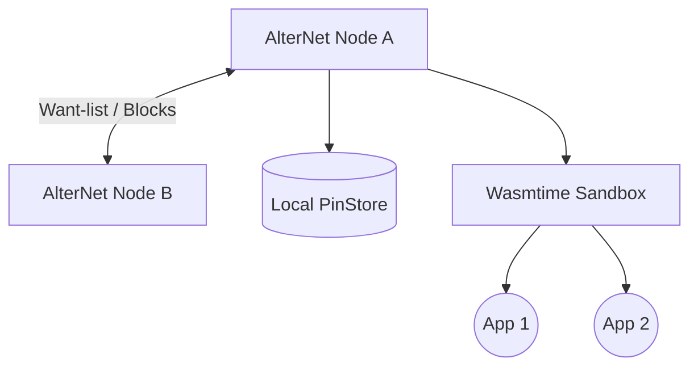

<div align="center">
  <h1>بِسْمِ اللَّهِ الرَّحْمَنِ الرَّحِيمِ</h1>
  <h2>AlterNet</h2>
  <p><b>Distributed, Immutable, Serverless Web Architecture</b></p>
  
  [](https://www.rust-lang.org)
  [](https://tauri.app/)
  [](https://webassembly.org/)
  [](LICENSE)
</div>

---

AlterNet is a **peer-to-peer, distributed hypermedia system and application host**. It is designed to replace central cloud infrastructure with an immutable, self-replicating network of nodes. AlterNet serves static content, executes WebAssembly applications safely, and acts as a global sovereign namespace.

## 🚀 Key Technical Features

### 1. Peer-to-Peer Block Store & IPFS-like Merkle DAGs



- **Content-Addressing:** Files and applications are referenced by the SHA-256 hash of their contents (`alter://<cid>`), ensuring cryptographic immutability.
- **Merkle DAGs:** Large files are chunked into 256KB blocks, encrypted, and distributed across the network via a Directed Acyclic Graph structure.
- **PinStore GC:** Nodes specify a maximum storage quota (e.g., 5GB). Unpinned orphaned blocks are periodically swept by the background Garbage Collector.

### 2. WASM Application Execution (Wasmtime)
- **Sandboxed Execution:** AlterNet applications run inside a WebAssembly sandbox with strict capability-gating.
- **Host Functions:** WebAssembly apps cannot make arbitrary network requests. They can only communicate via explicit host functions exported by the Rust core (e.g., `NetworkAccess`, `StorageWrite`).
- **Fuel Limits:** Computations are deterministic and restricted by a fuel limit, preventing CPU exhaustion or infinite loop attacks from malicious apps.

### 3. CRDT-Synchronized Boards
- **Distributed State:** Applications (like distributed task boards or chat rooms) sync state over the network using Conflict-Free Replicated Data Types (Automerge).
- **Eventual Consistency:** Network splits do not halt productivity; nodes merge their state automatically when reconnected.

### 4. Advanced Anonymity & Resilience
- **Tor integration (`libp2p-community-tor`):** Natively proxy outbound connections through the Tor network.
- **Onion Routing (Multi-Hop Relay):** Built-in capability to forward blocks and messages through intermediate nodes, obscuring the original requester.

---

## 🛠️ Build & Installation

### Prerequisites
- [Rust](https://www.rust-lang.org/tools/install) (1.85.0+)
- [Node.js](https://nodejs.org/) (20+)

### Running Locally
```bash
# Clone the repository
git clone https://github.com/your-org/alternet.git
cd alternet

# Install frontend dependencies
cd alternet-browser
npm install

# Run the Tauri AlterNet Browser
npm run tauri dev
```

### Running as a Headless Daemon
AlterNet provides a `systemd` compatible daemon for running on servers or Raspberry Pis.
```bash
cd alternet-daemon
cargo build --release
./target/release/alternet-daemon --config /etc/alternet/config.toml
```

---

## 📂 Project Structure

- `alternet-core/`: The headless Rust library containing block exchange (want-list), IPFS logic, replication, and the WASM runtime.
- `alternet-daemon/`: Headless node binary for dedicated hosting.
- `alternet-browser/`: The React/Tauri Desktop Application acting as a distributed web browser and runtime environment.

---

## 🔐 Security & Threat Model
Please refer to the [THREAT_MODEL.md](THREAT_MODEL.md) for a detailed breakdown of attack vectors (DDoS, Sybil, Poisoning) and our mitigation strategies.

For architectural decisions, refer to [ARCHITECTURE.md](ARCHITECTURE.md).

---

## 🖤 Support & Donate
If you believe in decentralized, censorship-resistant networks and want to support the ongoing development of AlterNet, consider donating. Your support helps keep the development sovereign and independent.

- **Monero (XMR):** `43bMdGQAkByAkbiGkgsuGbWf5afr2RBa42swxuqe7M8ohUSVbzaFAQabDivDtLcXJwQDNztZyhMSoiFkSvsCNouV2jACZyA` _(Privacy focused)_
- **Bitcoin (BTC):** `bc1q66wc9qq5w5k219ayv9mgm9jc3dkan757a7ufst`
- **Ethereum (ETH / ERC-20):** `0xC47BDDc11F70eb48f3c261186BdAA5A16E4448D0`

