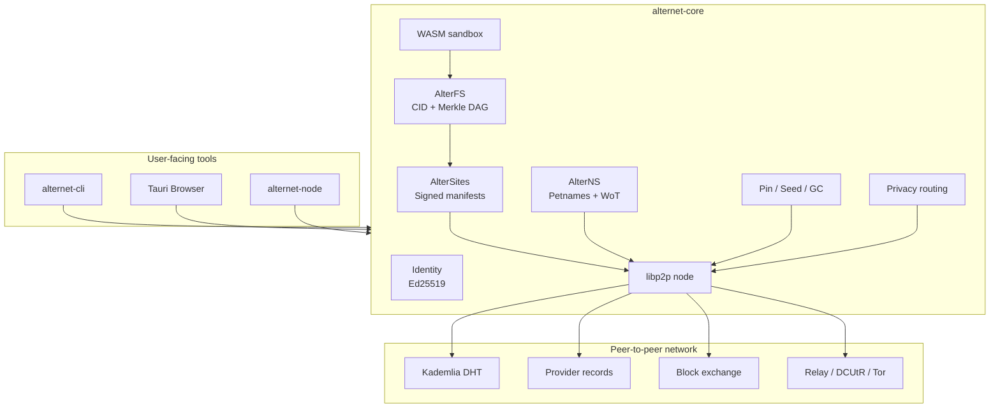

<div align="center">
  <h1>بِسْمِ اللَّهِ الرَّحْمَنِ الرَّحِيمِ</h1>
  <h2>AlterNet</h2>
  <p><strong>Serverless, accountless, content-addressed web infrastructure</strong></p>

  [](https://github.com/onurbaydas/AlterNet/actions/workflows/ci.yml)
  [](https://www.rust-lang.org/)
  [](https://tauri.app/)
  [](https://webassembly.org/)
  [](LICENSE)
</div>

---

## Overview

AlterNet is an experimental peer-to-peer publishing stack for an alternative
web: content is addressed by hash, sites are described by signed manifests,
names are local or Web-of-Trust based, and every device can become a client,
publisher, seed, or relay.

The repository contains:

- a Rust protocol library (`alternet-core`)
- a command-line publisher/fetcher (`alternet-cli`)
- a headless seed/relay daemon (`alternet-node`)
- a Tauri desktop browser (`alternet-browser`)
- a vendored Tor transport adapter for libp2p experiments

AlterNet is alpha-stage infrastructure. It is useful for local testing, protocol
experimentation, and research into serverless publishing. It has not completed
an independent security audit.

## Table of Contents

- [Core Ideas](#core-ideas)
- [Current Capabilities](#current-capabilities)
- [Repository Layout](#repository-layout)
- [Architecture at a Glance](#architecture-at-a-glance)
- [Quick Start](#quick-start)
- [CLI Examples](#cli-examples)
- [Desktop Browser](#desktop-browser)
- [Headless Node](#headless-node)
- [Docker](#docker)
- [Security Posture](#security-posture)
- [Development](#development)
- [Documentation Map](#documentation-map)
- [Project Status](#project-status)
- [License](#license)
- [Support](#support)

## Core Ideas

### Content Addressing

AlterNet stores content as Merkle DAG blocks. Each block is identified by a
BLAKE3-based 32-byte CID. If bytes change, the CID changes. A peer cannot serve
tampered data without being detected by the receiver.

### Signed Publishing

Sites are published as signed manifests. A manifest binds:

- author public key
- monotonically increasing sequence number
- Merkle DAG root CID
- metadata such as title, description, MIME type, tags, and encryption flag
- Ed25519 signature

This gives AlterNet mutable sites without giving up verification.

### Local Names, Not Global DNS

`alter://<self-certifying-key>` addresses are cryptographic. Human-friendly
names are local petnames or Web-of-Trust records. There is no registrar and no
global namespace to squat.

### Every Device Can Help

Any user can pin content and serve blocks to others. Popular content naturally
gains more replicas because more people keep it.

### Sandboxed Compute

AlterNet includes a WASM application host using `wasmtime`. Apps are signed,
hash-bound to their manifests, and run under a capability policy with fuel
limits.

## Current Capabilities

### AlterFS: Content Storage

- BLAKE3 CIDs.
- 256 KiB chunk size.
- Merkle DAG nodes for files and directories.
- Deterministic directory ordering.
- File-system block store with prefix sharding.
- Local quota enforcement.
- Optional leaf-content encryption using AES-256-GCM.
- CBOR serialization through `ciborium`.

### AlterSites: Publishing

- Ed25519-signed manifests.
- Monotonic sequence numbers for replay/rollback resistance.
- Manifest serialization/deserialization.
- Manifest history store for append-only local validation.
- Metadata fields for title, description, MIME type, tags, and encryption flag.

### AlterExchange: Block Transfer

- libp2p request-response protocol.
- `WantBlock`, `WantBlocks`, `HaveQuery`, `WantManifest`, and onion-forward
  request variants.
- CID verification after receiving block data.
- Maximum block-size guard in the network path.

### Network Layer

- Kademlia DHT provider records and key-value records.
- mDNS local discovery.
- Identify.
- libp2p request-response with CBOR.
- relay server/client and DCUtR behaviours.
- TCP with Noise and Yamux.
- optional Tor transport path through vendored `libp2p-community-tor`.
- chaff loop for padded privacy mode.

### AlterNS: Naming

- self-certifying `alter://` URIs.
- local petname store in CBOR.
- Web-of-Trust resolver with bounded BFS depth.
- signed petname lists.
- signed zone delegation for addresses such as `alter://alice/blog`.

### Replication

- pin records with root CID, author key, label, timestamps, and block list.
- persistent `pins.cbor` pin store.
- mark-and-sweep garbage collection.
- quota-aware unpinning of least-recently accessed content.
- headless node refresh loop for provider records.

### Discovery and Feeds

- signed tag claims.
- DHT tag keys.
- local tag index.
- Web-of-Trust subscription list.
- CLI feed pull command to fetch latest manifests from subscribed authors.

### WASM Apps

- signed `AppManifest`.
- BLAKE3 binding between manifest and WASM bytes.
- deny-all capability policy by default.
- optional capabilities: clock, content read, storage write, network access.
- wasmtime fuel limit for infinite-loop protection.

### Desktop Browser

- Tauri v2 backend.
- React desktop shell.
- `alter://` custom protocol handler.
- address bar, history, refresh, and sidebar.
- background fetch of published sites.
- local extraction and MIME serving of fetched DAGs.
- publish, pin, identity, and name-resolution commands.

## Repository Layout

```text
AlterNet-master/
├─ alternet-core/              Protocol library
│  ├─ src/content.rs           AlterFS block store and Merkle DAG
│  ├─ src/publish.rs           Signed manifests and manifest history
│  ├─ src/network.rs           libp2p node handle and swarm loop
│  ├─ src/naming.rs            Petnames, WoT resolver, zone delegation
│  ├─ src/replication.rs       Pins, seeding, garbage collection
│  ├─ src/routing.rs           privacy levels, padding, onion request wrapper
│  ├─ src/discovery.rs         tags and feed primitives
│  ├─ src/apps.rs              WASM capability sandbox
│  └─ src/board.rs             CRDT board/forum experiments
├─ alternet-cli/               Publish, fetch, pin, name, feed, app, board commands
├─ alternet-node/              Headless seed/relay daemon
├─ alternet-browser/           Tauri browser application
├─ libp2p-community-tor/       Vendored Tor transport adapter
├─ Dockerfile
├─ docker-compose.yml
├─ alternet.service
├─ ARCHITECTURE.md
├─ THREAT_MODEL.md
├─ SECURITY.md
└─ CONTRIBUTING.md
```

## Architecture at a Glance



The full module-level design is in [ARCHITECTURE.md](ARCHITECTURE.md).

## Quick Start

### Requirements

- **Rust 1.95+**. The current dependency graph uses `sysinfo 0.39.x`, which
  requires Rust 1.95 or newer.
- **Node.js 20+** for the Tauri browser.
- **npm**.
- Tauri v2 platform prerequisites.
- Docker, optional for the headless node.

Clone:

```bash
git clone https://github.com/onurbaydas/AlterNet.git
cd AlterNet
rustup update stable
cargo check --workspace
```

If Rust reports that `sysinfo` requires a newer compiler, update the stable
toolchain before continuing.

## CLI Examples

Generate an identity:

```bash
cargo run -p alternet-cli -- identity generate --password "change-me"
```

Show the current identity:

```bash
cargo run -p alternet-cli -- identity show --password "change-me"
```

Publish a site directory:

```bash
cargo run -p alternet-cli -- publish ./site \
  --title "My AlterNet Site" \
  --description "A serverless site" \
  --tag blog \
  --password "change-me"
```

The command prints an `alter://...` address.

Fetch a site:

```bash
cargo run -p alternet-cli -- fetch alter://YOUR_SITE_KEY --output ./fetched
```

Pin and reseed content:

```bash
cargo run -p alternet-cli -- pin alter://YOUR_SITE_KEY
```

Manage local petnames:

```bash
cargo run -p alternet-cli -- name set alice alter://ALICE_KEY
cargo run -p alternet-cli -- name list
cargo run -p alternet-cli -- name resolve alice
```

Search by tag:

```bash
cargo run -p alternet-cli -- search blog
```

Run a signed WASM app:

```bash
cargo run -p alternet-cli -- app run app.wasm \
  --manifest app.cbor \
  --cap clock \
  --fuel 10000000
```

## Desktop Browser

```bash
cd alternet-browser
npm install
npx tauri dev
```

Build:

```bash
cd alternet-browser
npm run build
npx tauri build
```

The browser registers an `alter://` custom protocol handler inside Tauri. When a
site is not present locally, the handler serves a loading page that asks the
backend to fetch the site from the P2P network.

## Headless Node

Run a seed/relay daemon:

```bash
cargo run -p alternet-node -- --port 4001 --storage-quota 10G
```

Use a TOML config:

```bash
cargo run -p alternet-node -- --config alternet-node/node.example.toml
```

Example config shape:

```toml
port = 4001
storage_quota = "10G"
relay_enabled = true
refresh_interval_secs = 3600

[[pin]]
uri = "alter://YOUR_SITE_KEY"
label = "Important mirror"
```

## Docker

The repository includes a Dockerfile and `docker-compose.yml` for running a
headless daemon:

```bash
docker compose up -d --build
```

Use Docker for seed nodes and lab deployments. For local publishing and browser
development, native Rust and Tauri workflows are easier to debug.

## Security Status

> **Alpha Software — Not Independently Audited**
>
> AlterNet has NOT undergone an independent security review.
> alter:// sites render in a sandboxed iframe (allow-scripts allow-same-origin).
> Tauri IPC is not accessible from within the iframe.

Known limitations in v0.1.0:

- alter:// sites render in a sandboxed iframe (allow-scripts allow-same-origin);
  Tauri IPC is not accessible from within the iframe. Full process isolation
  (separate OS process per site) is planned for v0.2.0.
- WASM app host functions (content_read, storage_write, net_request) are stubs
  in v0.1.0.
- Onion routing reply encryption is incomplete; use --privacy padded instead.
- Content availability depends on seeders; no guaranteed uptime.

## Security Posture

Implemented foundations:

- BLAKE3 content addressing.
- Ed25519 manifest signatures.
- monotonic manifest sequence checks.
- libp2p Noise transport encryption.
- Kademlia provider records.
- local pin store and quota-aware garbage collection.
- optional leaf content encryption.
- petname and zone delegation signatures.
- WASM signature verification, capability gating, and fuel limits.
- privacy levels for clear, padded, onion, and Tor modes.

Important limitations:

- No independent security audit has been completed.
- DHT records can leak what content is published, searched, or provided.
- Petname trust is social and local, not a global identity guarantee.
- Onion and Tor modes require careful application-layer metadata review.
- The WASM host contains placeholder host-function implementations for some
  capabilities.
- Browser extraction serves fetched files locally; malicious content is still
  content and should be treated as untrusted.

See [THREAT_MODEL.md](THREAT_MODEL.md) and [SECURITY.md](SECURITY.md).

## Development

Rust checks:

```bash
cargo fmt --all -- --check
cargo clippy --workspace --all-targets --all-features -- -D warnings
cargo test --workspace
```

Browser checks:

```bash
cd alternet-browser
npm install
npm run build
```

Security-sensitive changes should include tests or explicit manual verification.
This includes changes to CID verification, manifest signing, DHT records,
privacy routing, WASM capabilities, browser protocol handling, pinning, or
identity storage.

## Documentation Map

- [ARCHITECTURE.md](ARCHITECTURE.md): protocol architecture and data flow.
- [THREAT_MODEL.md](THREAT_MODEL.md): adversaries, mitigations, and gaps.
- [SECURITY.md](SECURITY.md): private vulnerability reporting.
- [CONTRIBUTING.md](CONTRIBUTING.md): contribution workflow.
- [libp2p-community-tor/README.md](libp2p-community-tor/README.md): Tor transport
  notes and misuse warnings.

## Project Status

AlterNet is an active prototype. The repository already contains substantial
protocol code, tests, and user-facing tooling, but it should be hardened before
high-risk use.

Suggested next milestones:

- complete end-to-end multi-node test scenarios
- add explicit DHT record signatures where missing
- add dependency audit tooling
- tighten browser security boundaries and CSP
- finish or clearly gate placeholder WASM host functions
- document bootstrap node operations
- run external review for publishing, naming, and routing layers

## License

AlterNet is licensed under the [GNU Affero General Public License v3.0](LICENSE).

## Support

If you want to support decentralized, censorship-resistant publishing research,
donations are welcome:

- **Monero (XMR):** `43bMdGQAkByAkbiGkgsuGbWf5afr2RBa42swxuqe7M8ohUSVbzaFAQabDivDtLcXJwQDNztZyhMSoiFkSvsCNouV2jACZyA`
- **Bitcoin (BTC):** `bc1q66wc9qq5w5k219ayv9mgm9jc3dkan757a7ufst`
- **Ethereum (ETH / ERC-20):** `0xC47BDDc11F70eb48f3c261186BdAA5A16E4448D0`
